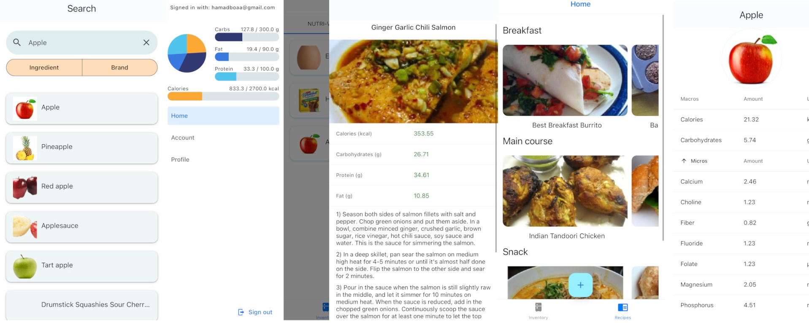

# Calorie Tracking App

Welcome to the source code repository for the Calorie Tracking App, a comprehensive application built using React Native. This app is designed to help users track their calorie intake, manage their food inventory, and maintain a healthy diet.

## Features

- **User Authentication**: Secure login and signup functionality using Firebase Authentication.
- **Food Inventory Management**: Add, update, and remove food items from your inventory.
- **Barcode Scanning**: Quickly add food items by scanning barcodes.
- **Recipe Management**: Search for recipes, view detailed nutritional information, and track consumed recipes.
- **Nutritional Tracking**: Monitor your daily intake of calories, carbs, fat, and protein.
- **Personal Profile**: Manage personal information, dietary preferences, and activity levels.

## Project Structure

The project is organized into the following main directories:

- **app**: Contains the main application screens and navigation setup.
- **src**: Contains the core logic, including API integrations, models, and components.
- **assets**: Contains static assets such as fonts and images.

## Dependencies

The project relies on several key dependencies, including:

- **React Native**: The core framework for building mobile applications.
- **Expo**: A framework and platform for universal React applications.
- **Firebase**: Used for authentication and database management.
- **React Navigation**: For handling navigation within the app.
- **React Native Paper**: For UI components and theming.

## License

This project is licensed under the MIT License. See the [LICENSE](LICENSE) file for more details.
